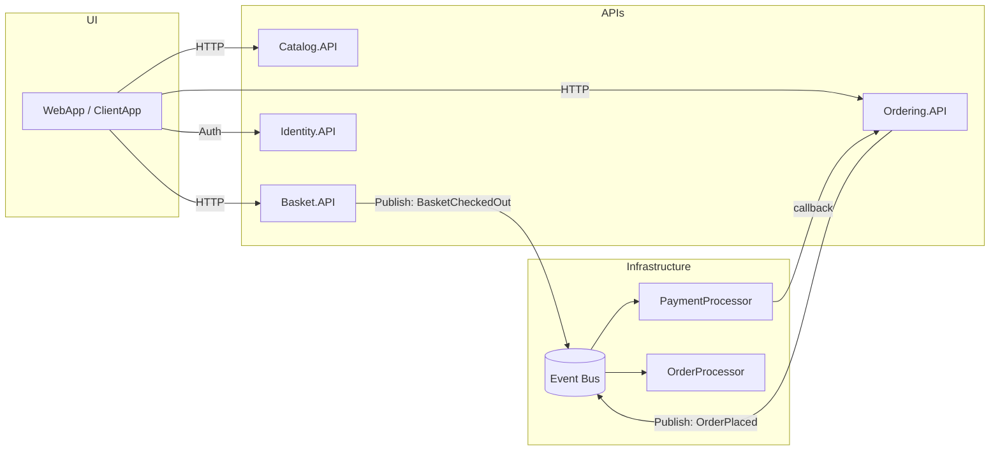
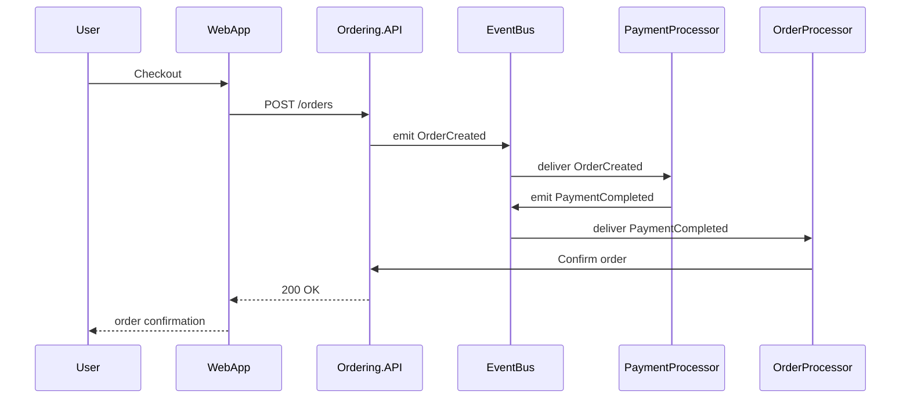

# Architecture & Repository layout

This page contains diagrams and a quick reference to the repository layout and the main runtime flows. The diagrams are intentionally lightweight (Mermaid) so you can edit them directly in the docs.

  <h1>System overview</h1>
  
A concise map of services and how events flow between them.

## System overview

## Order processing sequence

This sequence diagram shows what typically happens when a customer places an order.

## Event bus & reliability

The system uses an event-driven approach: APIs publish domain events to the event bus, and background processors consume them. Design considerations:

- Use idempotent consumers to handle duplicate events.
- Persist events and use retry semantics for transient failures.

## Repository layout quick reference

- `src/` — main source projects (APIs, workers, shared libs)
- `tests/` — unit and functional tests
- `.github/workflows/` — CI pipelines
- `artifacts/` — build outputs and published artifacts